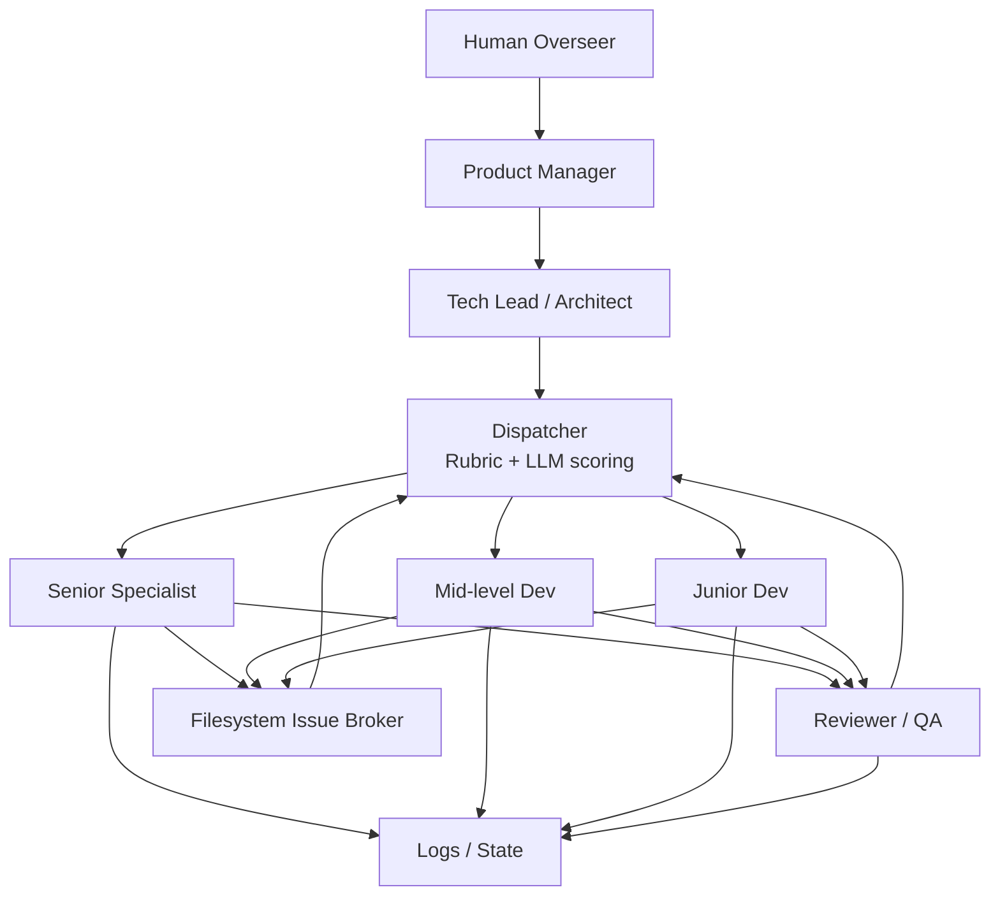

# Conductor Fleet Commander

A local-first orchestration daemon that manages a "remote team" of AI agents across multiple software projects. It transforms independent AI CLI tools into a coordinated, budget-aware development team — dispatched one task at a time, tracked via Markdown artifacts on the filesystem.

## How It Works



1. **Governance** — Human overseer sets direction; PM defines epics; Tech Lead decomposes into plans and tasks
2. **Dispatch** — The Dispatcher evaluates all pending tasks and selects the single best one for the next run
3. **Execution** — An AI agent (mapped to a persona like `@frontend` or `@backend`) executes the task via its CLI tool
4. **Communication** — Agents create Issue files (blockers, delegations, clarifications) routed through a filesystem broker
5. **Review** — Completed work is validated against spec and guidelines before being marked done
6. **Traceability** — Every decision, input, output, and error is captured in execution logs

## Core Features

- **Global Dashboard** — Web UI showing Kanban state of all registered projects, blockers, and resource burn
- **LLM Dispatcher** — Smart scheduler ranking tasks by priority, dependencies, persona fit, and estimated cost
- **Agent Registry** — Configure system prompts, CLI tools (`gemini-cli`, `claude code`, `aider`), and behavioral boundaries per persona
- **State-Driven Execution** — All coordination via persistent Markdown artifacts; daemon wakes, reads state, dispatches, updates, sleeps
- **Issue Tracking** — Structured Issue files for inter-agent communication (blockers, sub-tasks, help requests)
- **Execution Logging** — Full traceability of dispatcher decisions and agent outputs

## Tech Stack

- **Backend:** Go daemon — `net/http` server, `fsnotify` file watcher, `os/exec` process management, `gorilla/websocket` streaming
- **Frontend:** React (Vite) + Tailwind CSS + Shadcn UI
- **Agents:** External CLIs (`gemini-cli`, `claude code`, `aider`, or any prompt-accepting script)
- **Storage:** Filesystem Markdown artifacts + embedded SQLite / JSON for global state

## Project Structure

```
backend/                # Go daemon source
  cmd/daemon/           # Entry point (main.go)
  internal/             # Core packages (models, parser, watcher, runner)
frontend/               # Vite + React UI
  src/
conductor/              # Product specs, tracks, and plans (source of truth)
  product.md            # Product vision and features
  tech-stack.md         # Technology choices
  workflow.md           # Development workflow
  tracks.md             # Master list of tracks
  tracks/               # Individual track directories
```

## Development

```bash
# Backend (Go daemon)
cd backend && go run cmd/daemon/main.go

# Frontend (Vite dev server)
cd frontend && npm install && npm run dev

# Run tests
npm run test            # All tests
npm run test:main       # Main-process tests
npm run test:renderer   # Renderer tests

# Lint and type check
npm run check
```

## License

ISC
