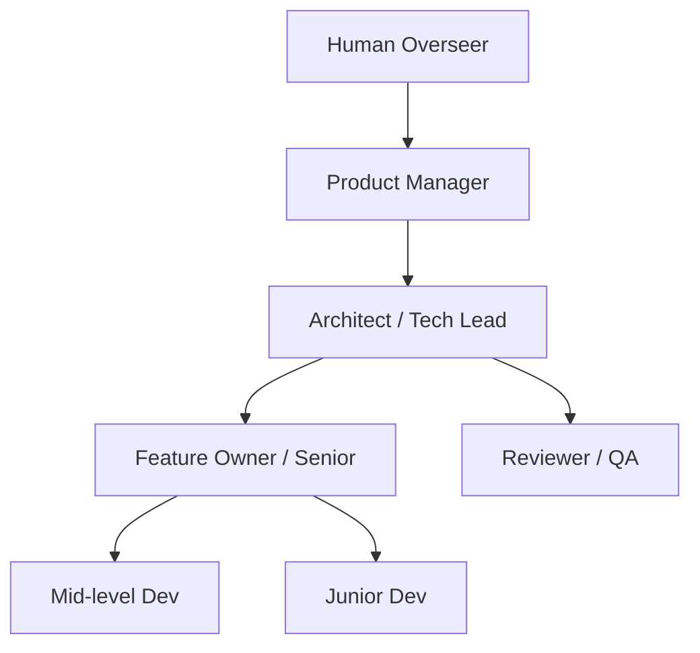
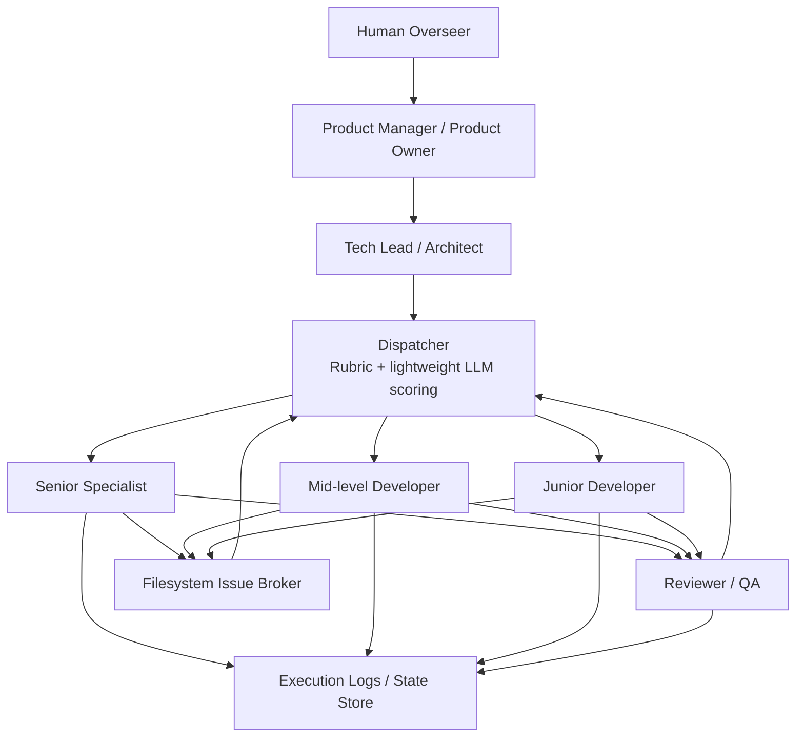

# Product Definition - Conductor Fleet Commander

## Vision & Goals

Conductor Fleet Commander is a local-first orchestration daemon designed to manage, schedule, and oversee a "remote team" of AI agents working across multiple local software projects. 

The system acts as a state-driven, batch-executed orchestration engine that transforms a collection of independent AI tools into a coordinated, budget-aware development team. 

- **Multi-Project Oversight:** Monitor the `conductor/` directory of multiple local repositories simultaneously.
- **Persona-Based AI Agents:** Define distinct AI "employees" (e.g., `@architect`, `@frontend`, `@backend`, `@reviewer`) with specific system prompts, capabilities, and cost profiles.
- **Single-Execution Constraint:** The orchestrator enforces strict determinism by ensuring that only **one task may be executed per orchestrator run**, and no two agents run concurrently.
- **Local Message Broker Protocol:** Solve the "Silo Problem" by allowing agents to communicate, block, or delegate tasks to one another using local Markdown artifacts (Issues) stored in the filesystem.

## Target Audience

- **Engineering Managers & Power Developers:** Users who want to delegate large portions of software engineering to a fleet of specialized local AI agents, acting as the human overseer, budget manager, and final reviewer.

## Core Features (MVP)

1. **Global Dashboard:** A single web UI (served by a local background daemon) displaying the Kanban state of all registered local projects, highlighting current tasks, blockers, and resource burn.
2. **The LLM Dispatcher (Prioritization Engine):** A smart scheduling engine that evaluates all pending tasks and open issues, ranking them based on priority, dependency resolution, persona suitability, and estimated cost, to select the single best task for the next run.
3. **Agent Registry:** A UI to configure the system prompts, execution tools (`gemini-cli`, `claude code`), and behavioral boundaries for each custom AI persona.
4. **State-Driven Execution:** Work is coordinated entirely via persistent artifacts (Markdown files). The Orchestrator daemon wakes up, reads the state, dispatches an agent, captures the output, updates the state, and goes back to sleep.
5. **Issue Tracking & Communication:** Agents can generate structured Issue files during execution to report blockers, spawn sub-tasks, or request help from other personas.
6. **Execution Logging:** Full traceability of all decisions, capturing inputs (task + persona), outputs, errors, and the logic used by the Dispatcher.

## Team Model & Role Hierarchy

The orchestrator models a structured development team with three distinct layers:

### Layer 1: Governance

| Role | Responsibility |
|------|---------------|
| **Human Overseer** | Final authority, budget approval, strategic direction |
| **Product Manager** | Creates epics, priorities, acceptance criteria |
| **Tech Lead / Architect** | Breaks work into implementation plans and tasks |

### Layer 2: Delivery

| Role | Responsibility |
|------|---------------|
| **Senior Specialist** | Receives complex/ambiguous tasks, shapes work for juniors |
| **Mid-level Developer** | Executes well-scoped tasks independently |
| **Junior Developer** | Executes pre-shaped tasks with clear acceptance criteria |
| **Feature Owner** (optional) | Coordinates a pod of contributors on a single track |

### Layer 3: Control & Quality

| Role | Responsibility |
|------|---------------|
| **Dispatcher** | Selects next best task using rubric + lightweight LLM scoring |
| **Reviewer / QA** | Validates completed work against spec and guidelines |
| **Filesystem Issue Broker** | Routes blockers, delegations, and clarifications between agents |
| **Execution Logs / State Store** | Provides full traceability of decisions and outputs |

> **Key principle:** Juniors should not receive raw product work; they receive shaped tasks from stronger roles.

### Role Hierarchy

### Work Lifecycle

**Flow summary:**
1. Human Overseer sets direction; PM defines epics and acceptance criteria
2. Tech Lead decomposes work into plans and tasks
3. Dispatcher evaluates all pending tasks and selects the single best task for the next run
4. Assigned agent executes the task — or creates an Issue (blocker / delegation / clarification)
5. Completed work goes to Reviewer / QA for validation
6. Issues route through the Filesystem Broker back to the Dispatcher for reassignment
7. All actions are captured in Execution Logs for traceability

## Default Agent Personas & Harness Definitions

The system ships with pre-configured agent personas and CLI harness definitions. These serve as the "factory team" and can be customized by the user.

- **Agent definitions:** [`conductor/agents/`](./agents/) — 8 default personas (architect, product-manager, senior-backend, senior-frontend, mid-dev, junior-dev, reviewer, dispatcher) as Markdown files with YAML frontmatter specifying mode, model, temperature, and tool permissions.
- **Harness definitions:** [`conductor/harnesses/`](./harnesses/) — 4 default CLI harness configs (Claude Code, Gemini CLI, Codex CLI, Opencode) as YAML files describing binary path, model discovery command, and invocation template.

Agent definitions follow a layered resolution model: bundled defaults < user-global overrides (`~/.conductor/agents/`) < per-project overrides (`conductor/agents/`).

## Architectural Paradigm

The system enforces clarity, determinism, and cost control through rigid constraints:

- **No Persistent Processes:** Agents are invoked intermittently (manual or scheduled) and terminate after their task is complete.
- **No Real-Time Agent Communication:** All coordination happens asynchronously through the filesystem broker.
- **The Spine (Programmatic Engine):** Dispatching, file watching, state management, and budget tracking are handled strictly by Go.
- **The Brain (LLM Layer):** Execution of engineering tasks and the triage/scoring of complex prioritization are handled by the LLMs.
